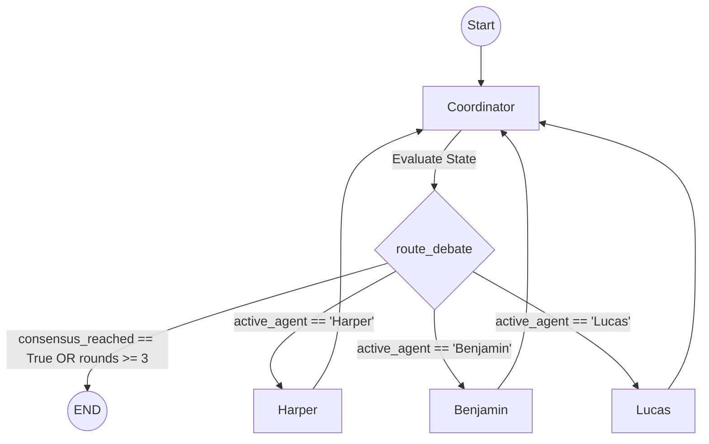

# Agent Flow and Architecture Structure

This document outlines the execution flow, state management, and routing conditions of the Multi-Agent Debate System. The system is orchestrated using LangGraph's `StateGraph`.

## 1. Core State Definition (`DebateState`)

The graph's state is the central source of truth, passed between nodes during execution.

```python
class DebateState(TypedDict):
    messages: Sequence[BaseMessage] # The history of the conversation
    active_agent: str               # The agent currently assigned to speak
    debate_rounds: int              # Counter to prevent infinite loops
    consensus_reached: bool         # Flag indicating if the debate is complete
    final_output: str               # The synthesized response for the user
```

## 2. Agent Nodes

The system consists of four primary nodes (agents):

*   **Coordinator (Entry Point & Router):**
    *   **Role:** Analyzes the current state (`messages`) and decides the next step.
    *   **Action:** Uses structured output (`RoutingDecision`) to determine if consensus is reached or which sub-agent should speak next.
    *   **Outputs:** Updates `active_agent`, `consensus_reached`, `final_output`, and increments `debate_rounds`.

*   **Harper (Researcher):**
    *   **Role:** Grounds the debate with facts, data, and external context.
    *   **Action:** Appends a new message to the `messages` list based on its persona.

*   **Benjamin (Logician):**
    *   **Role:** Stress-tests logic. Evaluates data or prompts for mathematical accuracy, code correctness, or logical fallacies.
    *   **Action:** Appends a new message to the `messages` list based on its persona.

*   **Lucas (Creative):**
    *   **Role:** Generates alternative angles, edge cases, and out-of-the-box narrative structures.
    *   **Action:** Appends a new message to the `messages` list based on its persona.

## 3. Execution Flow & Routing Logic

The execution follows a hub-and-spoke model where the Coordinator acts as the central hub.

### Step-by-Step Flow:

1.  **Initialization:** The graph is invoked with an initial `DebateState` containing the user's prompt, with `active_agent` set to "Coordinator".
2.  **Entry Point:** The graph always starts at the **Coordinator** node.
3.  **Coordinator Evaluation:**
    *   The Coordinator reviews the `messages`.
    *   It generates a `RoutingDecision`.
4.  **Conditional Routing (`route_debate`):**
    *   The graph evaluates the state updated by the Coordinator.
    *   **Condition A (Termination):** If `consensus_reached` is `True` OR `debate_rounds` >= 3:
        *   **Action:** Route to `END`. The execution stops, and the `final_output` is presented to the user.
    *   **Condition B (Delegation):** If `consensus_reached` is `False` AND `debate_rounds` < 3:
        *   **Action:** Route to the agent specified in `active_agent` (Harper, Benjamin, or Lucas).
5.  **Sub-Agent Execution:**
    *   The selected sub-agent (Harper, Benjamin, or Lucas) processes the state and appends their response to `messages`.
6.  **Return to Hub:**
    *   After *any* sub-agent executes, the graph has a forced edge back to the **Coordinator**.
7.  **Loop:** The process repeats from Step 3 until Condition A is met.

## 4. Visualizing the Graph



## 5. Memory and Persistence

*   **Checkpointer:** LangGraph's `SqliteSaver` is attached to the compiled graph.
*   **Storage:** State is saved to `a2a_memory.sqlite`.
*   **Mechanism:** Every time a node finishes execution, the current `DebateState` is saved against a specific `thread_id` (session ID). This allows debates to be paused, resumed, or reviewed later.
